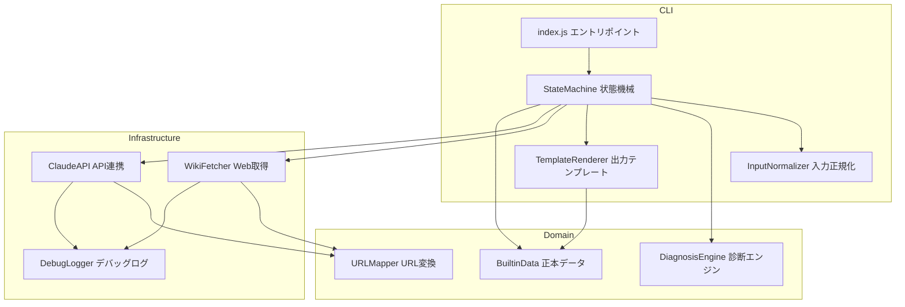
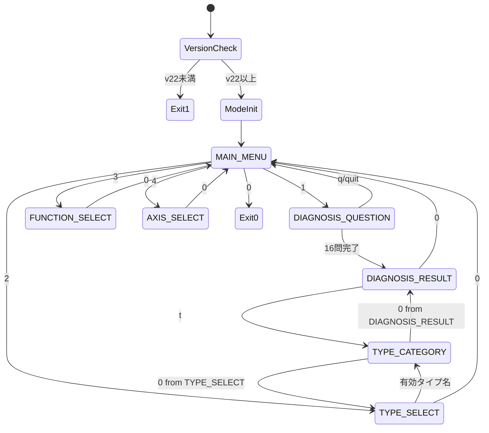
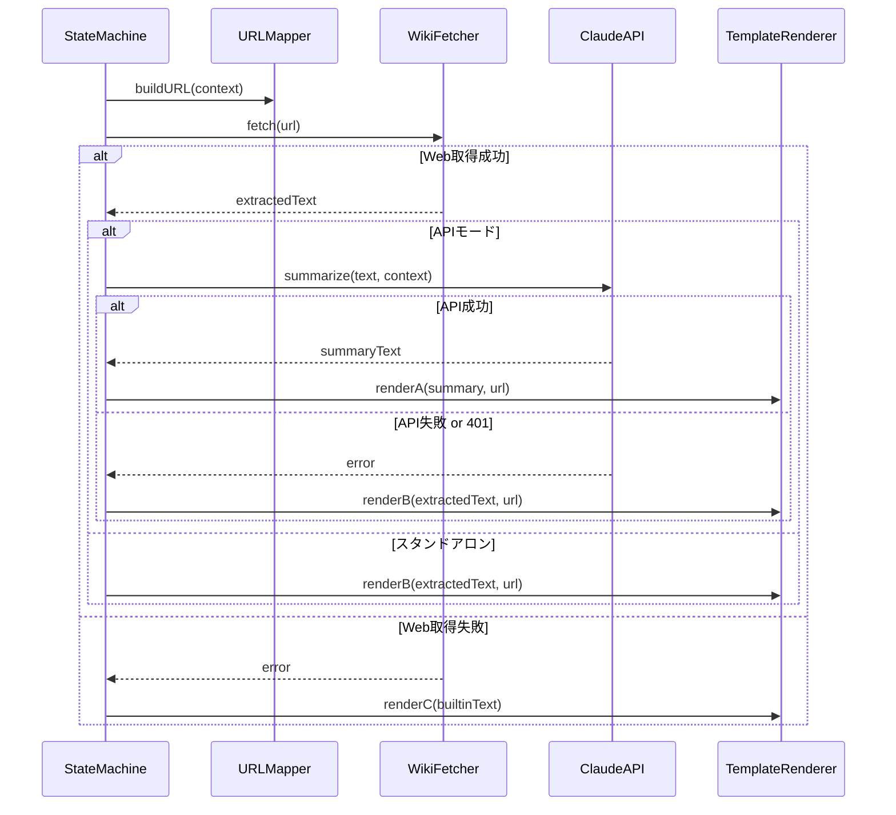

# Design Document

## Overview

**Purpose**: wikiwiki.jp/16types のコンテンツを知識源とする MBTI 診断・情報閲覧 CLI ボットを Node.js v22 で構築する。Anthropic Claude API によるAI要約はオプション機能であり、APIなしでも診断とビルトイン情報閲覧が動作する。

**Users**: MBTI に関心を持つ一般ユーザーが、ターミナルから対話的に診断・情報閲覧を行う。

**Impact**: 新規プロジェクト（グリーンフィールド）。既存システムへの影響なし。

### Goals
- 16問の固定質問による再現性のある MBTI 診断
- wikiwiki.jp からのコンテンツ取得と AI 要約（APIモード時）
- API 不要のスタンドアロン動作（ビルトインデータによるフォールバック）
- 7状態の一意な状態機械による予測可能な CLI 操作

### Non-Goals
- Web UI / GUI の提供
- ユーザーデータの永続化（データベース不要）
- 複数言語対応（日本語のみ）
- wikiwiki.jp 以外のデータソース対応

## Architecture

### Architecture Pattern & Boundary Map



**Architecture Integration**:
- **Selected pattern**: ドメイン分割モジュール構成。CLI 層・ドメイン層・インフラ層の3層に機能を分配
- **Domain boundaries**: 状態機械(SM)がオーケストレータとして各モジュールを呼び出す。モジュール間の直接依存は最小限
- **New components rationale**: 要件の16 Requirement を10モジュールにマッピング。各モジュールが独立してテスト可能

### Technology Stack

| Layer | Choice / Version | Role in Feature | Notes |
|-------|------------------|-----------------|-------|
| Runtime | Node.js v22+ | ESM, native fetch, readline/promises | Req 14.1 |
| HTML Parser | cheerio ^1.2.0 | DOM セレクタによる HTML 抽出 | 唯一の外部ランタイム依存 (Req 14.1) |
| HTTP Client | Node.js native fetch | Wiki 取得 + Claude API 呼び出し | 外部ライブラリ禁止 (Req 14.1) |
| CLI I/O | readline/promises | 対話型入力 + EOF/SIGINT 処理 | Node.js 組み込み |
| Test | Node.js test runner (node:test) | ユニット + 統合テスト | devDependencies は制限対象外 |

## System Flows

### メインループとコンテンツ表示フロー



### コンテンツ取得・表示フロー



**Key Decisions**:
- Web 取得は毎回試行するが、成功済み URL はキャッシュから返す (8.6)
- API 401 時は `apiMode` を `false` に切り替え、以降の全リクエストでスタンドアロン動作 (1.3)
- タイムアウト/接続エラーのみ1回再試行。他のエラーは即確定 (9.1)

## Requirements Traceability

| Requirement | Summary | Components | Interfaces |
|-------------|---------|------------|------------|
| 1.1-1.7 | 動作モード判定・起動表示 | StateMachine, Entry | ModeConfig |
| 2.1-2.8 | MBTI 診断ロジック | DiagnosisEngine | DiagnosisResult |
| 3.1-3.5 | タイプ詳細閲覧 | StateMachine, BuiltinData | ContentContext |
| 4.1-4.5 | 心理機能・軸解説 | StateMachine, BuiltinData | ContentContext |
| 5.1-5.12 | 状態遷移・UI表示 | StateMachine, InputNormalizer | StateData |
| 6.1-6.9 | 入力正規化 | InputNormalizer | NormalizeResult |
| 7.1-7.2 | URL 変換 | URLMapper | — |
| 8.1-8.9 | Web コンテンツ取得・整形 | WikiFetcher | FetchResult |
| 9.1-9.4 | 通信エラー処理 | WikiFetcher, ClaudeAPI | ErrorInfo |
| 10.1-10.6 | ビルトインデータ | BuiltinData | — |
| 11.1-11.3 | テンプレート・出典表示 | TemplateRenderer | — |
| 12.1 | 免責表示 | TemplateRenderer | — |
| 13.1-13.6 | ログ方針 | DebugLogger | — |
| 14.1-14.4 | 起動・設定・環境 | Entry | EnvConfig |
| 15.1-15.6 | Claude API 連携 | ClaudeAPI | ApiRequest, ApiResponse |
| 16.1-16.4 | テスト範囲 | （テスト設計） | — |

## Components and Interfaces

| Component | Domain/Layer | Intent | Req Coverage | Key Dependencies | Contracts |
|-----------|-------------|--------|-------------|-----------------|-----------|
| Entry (index.js) | CLI | エントリポイント。バージョンチェック・モード初期化・メインループ起動 | 1, 14 | StateMachine (P0) | — |
| StateMachine | CLI | 7状態の遷移制御・画面描画オーケストレーション | 1, 3, 4, 5, 9.3-9.4, 11.2 | InputNormalizer (P0), DiagnosisEngine (P0), WikiFetcher (P1), ClaudeAPI (P1), TemplateRenderer (P0), BuiltinData (P0) | State |
| InputNormalizer | CLI | トリム・全角半角変換・判定順序制御 | 6 | — | Service |
| DiagnosisEngine | Domain | 16問スコアリング・タイプ判定 | 2 | BuiltinData (P0) | Service |
| BuiltinData | Domain | 16タイプ・8機能・4軸の正本データ提供 | 10, 付録A | — | Service |
| URLMapper | Domain | コンテキストから wikiwiki.jp URL を生成 | 7 | — | Service |
| WikiFetcher | Infra | HTTP 取得・cheerio による HTML 抽出・キャッシュ | 8, 9.1 | cheerio (P0 External), DebugLogger (P2) | Service |
| ClaudeAPI | Infra | Anthropic Messages API 呼び出し・レスポンス検証 | 9.2, 15 | DebugLogger (P2) | Service |
| TemplateRenderer | CLI | テンプレート A/B/C 選択・フォーマット・出力 | 11, 12 | BuiltinData (P1) | Service |
| DebugLogger | Infra | DEBUG=1 時のみ stderr 出力 | 13 | — | Service |

### CLI Layer

#### Entry (index.js)

| Field | Detail |
|-------|--------|
| Intent | プロセス起動・バージョンガード・環境変数読み込み・モード初期化・メインループ開始 |
| Requirements | 1.1, 1.4, 1.5, 1.6, 14.1, 14.2, 14.3, 14.4 |

**Responsibilities & Constraints**
- Node.js バージョンチェックを最初に実施（v22 未満で exit code 1）
- 環境変数から `EnvConfig` を構築（ANTHROPIC_API_KEY, ANTHROPIC_MODEL, DEBUG）
- `apiMode` / `degradedBy401` の初期値を設定
- readline インターフェース生成と SIGINT/EOF ハンドリング登録
- 起動バナー出力後に StateMachine へ制御を渡す

**起動バナーの固定出力 (Req 1.4-1.6)** — 起動時1回のみ出力。MAIN_MENU 再入場時・API 401 降格後の再入場時には再表示しない:

出力順序（各項目間に空行なし）: ① モード表示 → ② APIキー案内（スタンドアロン時のみ）→ ③ MAIN_MENU メニュー

*APIモード*:
```
[モード: APIモード ([実効モデル名])]
```
`[実効モデル名]` は Req 15.1 のデフォルト適用後の値（トリム後、空ならデフォルト `claude-sonnet-4-6`）

*スタンドアロンモード*:
```
[モード: スタンドアロン - AI要約無効]
APIキーを設定するとAI要約が利用できます: export ANTHROPIC_API_KEY=sk-ant-...
```
2行目の APIキー案内も起動時1回のみ。API 401 降格後の MAIN_MENU 再入場時には表示しない（降格バナーのみ表示。降格バナーは StateMachine が担当）

**Dependencies**
- Outbound: StateMachine — メインループの委譲 (P0)

**Contracts**: State [x]

##### State Management

```javascript
/** @typedef {'API' | 'STANDALONE'} InitialMode */

/** @typedef {Object} EnvConfig
 * @property {string | undefined} apiKey - ANTHROPIC_API_KEY（トリム済み、空なら undefined）
 * @property {string} model - 実効モデル名（トリム後、デフォルト適用済み）
 * @property {boolean} debug - DEBUG=1 かどうか
 */

/** @typedef {Object} ProcessState
 * @property {boolean} apiMode - 実効モード（true=API, false=スタンドアロン）
 * @property {boolean} degradedBy401 - API 401 による降格フラグ
 */
```

- Preconditions: `process.versions.node` のメジャーバージョンが 22 以上
- Postconditions: readline インターフェースが開き、StateMachine のループが開始されている

**Implementation Notes**
- バージョンチェックは `parseInt(process.versions.node)` で実施
- 全ユーザー向け出力は `process.stdout.write` または `console.log`（stdout）で出力。stderr は DebugLogger 経由のみ

**終了処理の単一経路 (Req 5.4, 5.10, 5.11)**:
- EOF（readline `close` イベント）・SIGINT（`process.on('SIGINT', ...)`）・MAIN_MENU `0` の全てを **単一の `shutdown()` 関数** に集約する
- `shutdown()` は **二重実行防止フラグ**（`let shuttingDown = false`）を持ち、2回目以降の呼び出しは即 return する
- 処理順序: ① フラグを `true` に設定 → ② readline インターフェースを閉じる（`rl.close()`）→ ③ `終了します。` を stdout に出力 → ④ `process.exit(0)`
- SIGINT ハンドラで `rl.close()` を呼ぶと `close` イベントも発火するが、フラグにより `shutdown()` の二重実行は防止される
- `rl.close()` を先に呼ぶことで、③の出力がプロンプト文字列と混在することを防ぐ

**固定文言と終了条件 (Req 5.4, 5.10, 5.11, 14.2)**:

| トリガー | 表示文言 | exit code |
|---------|---------|-----------|
| Node.js v22 未満 (14.2) | `Node.js v22以上が必要です（現在: vX.X.X）。` | 1 |
| MAIN_MENU の `0` (5.4) | `終了します。` | 0 |
| EOF / Ctrl+D (5.10) | `終了します。` | 0 |
| SIGINT / Ctrl+C (5.11) | `終了します。` | 0 |

- バージョン不足時はモード判定・バナー表示・MAIN_MENU 表示を一切行わず即終了
- EOF/SIGINT は現在の状態にかかわらず即終了（readline インターフェースを閉じてから表示）

---

#### StateMachine

| Field | Detail |
|-------|--------|
| Intent | 7状態の遷移制御、画面描画、コンテンツ取得オーケストレーション |
| Requirements | 1.3, 1.7, 3.1-3.3, 4.1-4.2, 5.1-5.12, 9.3-9.4, 11.2 |

**Responsibilities & Constraints**
- 7状態の遷移ループ（入力受付 → InputNormalizer → 判定 → 遷移 / コンテンツ表示）
- 画面遷移データの保持・クリア
- 状態入場時の画面描画
- 401 降格後の MAIN_MENU バナー表示制御

**受理入力と遷移先 (Req 5.2)** — 設計の正本。この表に定義されたパターン以外の遷移は発生しない:

| 状態 | 受理入力 | 遷移先 |
|------|---------|--------|
| MAIN_MENU | `1` | DIAGNOSIS_QUESTION |
| MAIN_MENU | `2` | TYPE_SELECT |
| MAIN_MENU | `3` | FUNCTION_SELECT |
| MAIN_MENU | `4` | AXIS_SELECT |
| MAIN_MENU | `0` | 終了（exit code 0） |
| MAIN_MENU | `help` | MAIN_MENU（維持） |
| DIAGNOSIS_QUESTION | `A` / `B` | DIAGNOSIS_QUESTION（次の問へ）→ 16問完了で DIAGNOSIS_RESULT |
| DIAGNOSIS_QUESTION | `Q` / `QUIT` | 「診断を中断しました。」を表示後、MAIN_MENU へ遷移 |
| DIAGNOSIS_QUESTION | `help` | DIAGNOSIS_QUESTION（維持） |
| DIAGNOSIS_RESULT | `t` | TYPE_CATEGORY（previousState=DIAGNOSIS_RESULT, currentType=診断確定タイプ） |
| DIAGNOSIS_RESULT | `0` | MAIN_MENU |
| DIAGNOSIS_RESULT | `help` | DIAGNOSIS_RESULT（維持） |
| TYPE_SELECT | 有効タイプ名 | TYPE_CATEGORY（previousState=TYPE_SELECT, currentType=正規化後タイプ名） |
| TYPE_SELECT | `0` | MAIN_MENU |
| TYPE_SELECT | `help` | TYPE_SELECT（維持） |
| TYPE_CATEGORY | `1`〜`7` | TYPE_CATEGORY（コンテンツ表示後維持） |
| TYPE_CATEGORY | `0` | previousState へ戻る |
| TYPE_CATEGORY | `help` | TYPE_CATEGORY（維持） |
| FUNCTION_SELECT | 有効機能略称 | FUNCTION_SELECT（コンテンツ表示後維持） |
| FUNCTION_SELECT | `0` | MAIN_MENU |
| FUNCTION_SELECT | `help` | FUNCTION_SELECT（維持） |
| AXIS_SELECT | 有効軸略称 | AXIS_SELECT（コンテンツ表示後維持） |
| AXIS_SELECT | `0` | MAIN_MENU |
| AXIS_SELECT | `help` | AXIS_SELECT（維持） |

**固定画面レイアウト (Req 5.12)** — 状態入場時に描画する完全な出力形式:

*MAIN_MENU（他の状態からの遷移時に再描画。help/無効入力による状態維持では再描画しない）*:
```
=============================
 MBTI Bot
=============================
1. MBTI診断
2. タイプを調べる
3. 心理機能を調べる
4. 心理傾向軸を調べる
0. 終了
[1/2/3/4/0/help]:
```
401 降格後は直前に `[モード: スタンドアロン - API 401により切り替え済み]` を1行追加（空行なし）

*DIAGNOSIS_QUESTION（各質問を表示するたびに出力）*:
```
--- 質問 [N] / 16 ([軸名]) ---
[質問文]
  A: [A選択肢テキスト]
  B: [B選択肢テキスト]
[A/B/q(中断)/help]:
```

*DIAGNOSIS_RESULT（入場・復帰のたびに全画面再描画）*:
```
=== 診断結果 ===
あなたのタイプ: [XXXX]
得点内訳: [E+2 / N-4 / F0→F / P-2]

[概要説明（100字以内）]
参考: https://wikiwiki.jp/16types/[XXXX]

※ この診断は参考用の簡易テストです。公式のMBTI診断（Myers-Briggs Type Indicator®）とは
  異なります。正確なタイプを知るには資格保持者によるフィードバックセッションを受けることを
  推奨します。
[t: このタイプを詳しく調べる / 0: メインメニューへ / help]:
```

*TYPE_SELECT（入場時に再描画）*:
```
=== タイプを調べる ===
タイプ名を入力してください（例: INTJ / enfp）
対応タイプ: ESTJ ESTP ESFJ ESFP ENTJ ENTP ENFJ ENFP ISTJ ISTP ISFJ ISFP INTJ INTP INFJ INFP
[タイプ名(例:INTJ)/0/help]:
```

*TYPE_CATEGORY（入場時・カテゴリ表示後に再描画）*:
```
=== [タイプ名] を調べる ===
1. 基本的な特徴
2. 美徳と限界・挑戦課題
3. 人間関係・恋愛
4. 趣味
5. ストレスと対処法
6. リーダーシップ
7. 適職・キャリア
0. 戻る
[1-7/0/help]:
```

*FUNCTION_SELECT（入場時に再描画）*:
```
=== 心理機能を調べる ===
機能略称を入力してください（大文字小文字不問）
対応機能: Se Si Ne Ni Te Ti Fe Fi
[機能略称(例:Ni)/0/help]:
```

*AXIS_SELECT（入場時に再描画）*:
```
=== 心理傾向軸を調べる ===
軸略称を入力してください（大文字小文字不問）
対応軸: EI SN TF JP
[軸略称(例:SN)/0/help]:
```

**UI 表示契約 (Req 5.6-5.8)**:

*ヒント行（各状態で入力待ち前に表示。Req 5.6）*:

| 状態 | ヒント行 |
|------|---------|
| MAIN_MENU | `[1/2/3/4/0/help]:` |
| DIAGNOSIS_QUESTION | `[A/B/q(中断)/help]:` |
| DIAGNOSIS_RESULT | `[t: このタイプを詳しく調べる / 0: メインメニューへ / help]:` |
| TYPE_SELECT | `[タイプ名(例:INTJ)/0/help]:` |
| TYPE_CATEGORY | `[1-7/0/help]:` |
| FUNCTION_SELECT | `[機能略称(例:Ni)/0/help]:` |
| AXIS_SELECT | `[軸略称(例:SN)/0/help]:` |

*help 表示コンテンツ（行頭スペース2つの箇条書き `  コマンド: 説明` 形式。末尾に `  help: このヘルプを表示`。Req 5.8）*:

| 状態 | help 項目 |
|------|----------|
| MAIN_MENU | `1: MBTI診断を開始する` / `2: タイプを調べる` / `3: 心理機能を調べる` / `4: 心理傾向軸を調べる` / `0: 終了` |
| DIAGNOSIS_QUESTION | `A: 選択肢Aを選ぶ` / `B: 選択肢Bを選ぶ` / `q / quit: 診断を中断してメインメニューへ戻る` |
| DIAGNOSIS_RESULT | `t: 診断されたタイプの詳細を調べる（TYPE_CATEGORYへ）` / `0: メインメニューへ戻る` |
| TYPE_SELECT | `[タイプ名]: 対応タイプのカテゴリへ進む（例: INTJ）` / `0: メインメニューへ戻る` |
| TYPE_CATEGORY | `1〜7: 各カテゴリのコンテンツを表示` / `0: 前の画面へ戻る（タイプ選択または診断結果）` |
| FUNCTION_SELECT | `[機能略称]: 機能の解説を表示（例: Ni、大文字小文字不問）` / `0: メインメニューへ戻る` |
| AXIS_SELECT | `[軸略称]: 軸の解説を表示（例: SN、大文字小文字不問）` / `0: メインメニューへ戻る` |

*無効入力時の表示 (Req 5.7)*:
- **汎用**: 「無効な入力です。」→ ヒント行のみ再表示（初期表示ヘッダー・メニュー・コンテンツは再描画しない）
- **個別エラーメッセージ（汎用より優先）**:
  - TYPE_SELECT (3.5): 「無効なタイプ名です（例: INTJ）。再入力してください。」
  - FUNCTION_SELECT (4.4): 「無効な機能略称です（例: Ni）。再入力してください。」
  - AXIS_SELECT (4.5): 「無効な軸略称です（例: SN）。再入力してください。」
- **DIAGNOSIS_QUESTION 例外**: エラーメッセージ後に現在の質問画面（質問文 + 選択肢 + ヒント行）を再描画
- **help 後**: DIAGNOSIS_QUESTION 以外はヒント行のみ再表示。DIAGNOSIS_QUESTION は質問画面を再描画

**Dependencies**
- Inbound: Entry — メインループ委譲 (P0)
- Outbound: InputNormalizer — 入力処理 (P0)
- Outbound: DiagnosisEngine — 診断実行 (P0)
- Outbound: WikiFetcher — Web 取得 (P1)
- Outbound: ClaudeAPI — AI 要約 (P1)
- Outbound: TemplateRenderer — 出力生成 (P0)
- Outbound: BuiltinData — フォールバックデータ (P0)
- Outbound: URLMapper — URL 生成 (P0)

**Contracts**: State [x]

##### State Management

```javascript
/** @typedef {'MAIN_MENU' | 'DIAGNOSIS_QUESTION' | 'DIAGNOSIS_RESULT' | 'TYPE_SELECT' | 'TYPE_CATEGORY' | 'FUNCTION_SELECT' | 'AXIS_SELECT'} State */

/** @typedef {Object} TransitionData
 * @property {string | null} currentType - 正規化後タイプ名（大文字4文字）or null
 * @property {State | null} previousState - TYPE_CATEGORY の遷移元
 * @property {DiagnosisResult | null} diagnosisResult - 診断結果
 */
```

**TransitionData のライフサイクル (Req 5.3)**:

| データ | 設定 | クリア |
|--------|------|--------|
| `currentType` | TYPE_SELECT で有効タイプ入力時 / DIAGNOSIS_RESULT で `t` 入力時 | TYPE_CATEGORY → `0` → **TYPE_SELECT**: 即クリア。TYPE_CATEGORY → `0` → **DIAGNOSIS_RESULT**: 維持。MAIN_MENU 到達: クリア |
| `previousState` | TYPE_CATEGORY 入場時に遷移元を記録 | TYPE_CATEGORY 離脱時（暗黙） |
| `diagnosisResult` | DIAGNOSIS_QUESTION 16問完了時 | MAIN_MENU 到達: クリア。TYPE_CATEGORY 経由 DIAGNOSIS_RESULT 復帰: 維持 |

**ProcessState のライフサイクル (Req 5.3)**:

| データ | 設定 | 変更条件 |
|--------|------|----------|
| `apiMode` | 起動時に ANTHROPIC_API_KEY 有無で決定 | `true` → `false`: API 401 受信時のみ。復帰なし |
| `degradedBy401` | 起動時 `false` | `true` への変更: API 401 受信時のみ。以降変わらない |

- Invariants: 状態遷移は Req 5.2 の遷移表に定義されたパターンのみ許可。定義外の遷移は発生しない

---

#### InputNormalizer

| Field | Detail |
|-------|--------|
| Intent | ユーザー入力のトリム・全角半角変換・判定順序制御 |
| Requirements | 6.1-6.9 |

**Responsibilities & Constraints**

**共通正規化 (Req 6.1-6.2)** — 全入力に対して最初に適用:
1. 全角スペース (U+3000) を半角スペースに変換
2. 前後の空白をトリム
3. **トリム後が空文字 → 即座に `type: 'invalid'` を返す**（Req 5.9。判定順序に進まない）
4. 全角英字 (Ａ〜Ｚ, ａ〜ｚ) → 半角英字、全角数字 (０〜９) → 半角数字に変換

**4段階判定順序 (Req 6.3)** — 共通正規化後の文字列に対して適用:

| ステップ | 判定 | 詳細 |
|---------|------|------|
| 1 | `help` | 小文字化して `'help'` と比較。一致すれば `type: 'help'`。以降の変換は適用しない |
| 2 | `0` | 文字列が `'0'` と一致するか確認。DIAGNOSIS_QUESTION なら `type: 'invalid'`（Req 5.5）、それ以外なら `type: 'zero'` |
| 3 | 状態固有予約コマンド | 下記の状態別表を参照 |
| 4 | 状態別形式変換+ドメイン値判定 | 下記の状態別表を参照。変換後にドメイン値（16タイプ名/8機能略称/4軸略称）と一致しなければ `type: 'invalid'` |

**状態固有予約コマンド（ステップ3）と状態別形式変換（ステップ4）**:

| 状態 | ステップ3 | ステップ4（形式変換） |
|------|----------|---------------------|
| MAIN_MENU | `'1'`〜`'4'` → `type: 'menu_item'` | — |
| DIAGNOSIS_QUESTION | 大文字化して `'A'`/`'B'` → `type: 'answer_a'`/`'answer_b'`。大文字化して `'Q'`/`'QUIT'` → `type: 'quit'` | — |
| DIAGNOSIS_RESULT | 小文字化して `'t'` → `type: 'navigate_t'` | — |
| TYPE_SELECT | — | **全文字を大文字に変換**（例: `intj` → `INTJ`）。16タイプに一致すれば `type: 'domain_value'` |
| TYPE_CATEGORY | `'1'`〜`'7'` → `type: 'category_item'` | — |
| FUNCTION_SELECT | — | **先頭大文字・2文字目小文字**（例: `SE` → `Se`）。8機能に一致すれば `type: 'domain_value'` |
| AXIS_SELECT | — | **全文字を大文字に変換**（例: `ei` → `EI`）。4軸に一致すれば `type: 'domain_value'` |

いずれのステップにも一致しなければ `type: 'invalid'`

**Contracts**: Service [x]

##### Service Interface

```javascript
/** @typedef {'help' | 'zero' | 'quit' | 'answer_a' | 'answer_b' | 'navigate_t' | 'menu_item' | 'category_item' | 'domain_value' | 'invalid'} InputType */

/** @typedef {Object} NormalizeResult
 * @property {InputType} type - 判定結果の種別
 * @property {string} raw - トリム・全角半角変換後の文字列
 * @property {string} [value] - 状態別変換後の値（domain_value, menu_item, category_item 時）
 */

/**
 * @param {string} rawInput - readline から受け取った生入力
 * @param {State} currentState - 現在の状態
 * @returns {NormalizeResult}
 */
function normalize(rawInput, currentState) {}
```

- Preconditions: `rawInput` は readline が返した文字列（null は EOF として呼び出し元で処理済み）
- Postconditions: 返却値の `type` が `'invalid'` 以外なら、`value` は後段の処理で直接使用可能な正規化済み文字列

---

### Domain Layer

#### DiagnosisEngine

| Field | Detail |
|-------|--------|
| Intent | 16問の固定質問による MBTI 診断。スコアリング・タイプ判定・得点内訳生成 |
| Requirements | 2.1-2.8 |

**Responsibilities & Constraints**
- 16問の固定質問セット（Req 2.8 の正本テーブル）をソースコード定数として保持
- 軸ごとの出題順序: E/I → S/N → T/F → J/P（各4問）
- スコアリング: A=+1, B=-1。同点時のデフォルト: I/N/F/P
- 得点内訳フォーマット生成（例: `E+2 / N-4 / F0→F / P-2`）

**Contracts**: Service [x]

##### Service Interface

```javascript
/** @typedef {Object} Question
 * @property {number} id - 1-16
 * @property {'EI' | 'SN' | 'TF' | 'JP'} axis
 * @property {string} text - 質問文
 * @property {string} choiceA - A選択肢テキスト（スコア表記なし）
 * @property {string} choiceB - B選択肢テキスト（スコア表記なし）
 */

/** @typedef {Object} DiagnosisResult
 * @property {string} type - 確定タイプ（例: 'INTJ'）
 * @property {string} scoreBreakdown - 得点内訳文字列（例: 'E+2 / N-4 / F0→F / P-2'）
 * @property {{ EI: number, SN: number, TF: number, JP: number }} scores - 各軸スコア
 */

/** @returns {readonly Question[]} 全16問（順序固定） */
function getQuestions() {}

/**
 * @param {Array<'A' | 'B'>} answers - 16問の回答配列（インデックス = 質問ID - 1）
 * @returns {DiagnosisResult}
 */
function evaluate(answers) {}
```

- Preconditions: `answers` の長さは 16。各要素は `'A'` または `'B'`
- Postconditions: `type` は16タイプのいずれか。`scoreBreakdown` は Req 2.5 のフォーマットに準拠
- Invariants: 同じ `answers` からは常に同じ `DiagnosisResult` が返る（純粋関数）

---

#### BuiltinData

| Field | Detail |
|-------|--------|
| Intent | 16タイプ・8心理機能・4傾向軸の正本データ提供 |
| Requirements | 10.1-10.6, 付録A |

**Responsibilities & Constraints**
- 付録A.1〜A.3 のデータをソースコード定数として保持（文字列一致必須）
- テンプレートCのビルトイン情報テキスト生成（`formatBuiltinText`。下記の固定フォーマットに従う）
- 主/補機能タイプ一覧の生成（Req 4.3）
- カテゴリ正本名・機能正本名・軸正本名テーブルの提供

**テンプレートC用ビルトイン文面の固定フォーマット (Req 10.6)**:

*心理機能（FUNCTION_SELECT）*:
```
[機能フルネーム]（[機能略称]）
[1行説明]
主機能: [タイプ名, ...] / 補助機能: [タイプ名, ...]
```
例: `内向的直観（Ni）` / `将来の可能性や抽象的なパターンを洞察する機能。` / `主機能: INFJ, INTJ / 補助機能: ENFJ, ENTJ`

*心理傾向軸（AXIS_SELECT）*:
```
[軸フルネーム]（[軸略称]）
[1行説明]
[第1極の名称]（[第1極の略称]）: [第1極の説明]
[第2極の名称]（[第2極の略称]）: [第2極の説明]
```
例: `感覚と直観（SN）` / `情報をどのように収集・処理するかを示す軸。` / `感覚（S）: 具体的な事実・現実・経験を重視する` / `直観（N）: 可能性・パターン・意味を重視する`

*タイプ詳細カテゴリ1「基本的な特徴」（TYPE_CATEGORY）*:
```
[タイプ名]
[概要説明]
主機能: [機能略称] / 補助機能: [機能略称]
```
例: `INTJ` / `独創的な戦略家。長期的なビジョンを持ち、論理と直観で目標を実現する。` / `主機能: Ni / 補助機能: Te`

*カテゴリ2〜7のフォールバック*: 「この項目のビルトイン情報はありません。」

**Contracts**: Service [x]

##### Service Interface

```javascript
/** @typedef {Object} TypeData
 * @property {string} name - タイプ名（例: 'INTJ'）
 * @property {string} summary - 概要説明（100字以内）
 * @property {string} mainFunction - 主機能略称（例: 'Ni'）
 * @property {string} auxFunction - 補助機能略称（例: 'Te'）
 * @property {string} url - タイプ基本ページURL
 */

/** @typedef {Object} FunctionData
 * @property {string} abbr - 機能略称（例: 'Ni'）
 * @property {string} fullName - 機能フルネーム（例: '内向的直観'）
 * @property {string} description - 1行説明
 * @property {string[]} mainTypes - 主機能タイプ（アルファベット昇順）
 * @property {string[]} auxTypes - 補助機能タイプ（アルファベット昇順）
 */

/** @typedef {Object} AxisData
 * @property {string} abbr - 軸略称（例: 'SN'）
 * @property {string} fullName - 軸フルネーム（例: '感覚と直観'）
 * @property {string} description - 1行説明
 * @property {{ name: string, abbr: string, description: string }} pole1 - 第1極
 * @property {{ name: string, abbr: string, description: string }} pole2 - 第2極
 */

function getType(name) {}        // @returns {TypeData | undefined}
function getFunction(abbr) {}    // @returns {FunctionData | undefined}
function getAxis(abbr) {}        // @returns {AxisData | undefined}
function getAllTypes() {}         // @returns {readonly TypeData[]}
function getCategoryName(num) {} // @returns {string} カテゴリ正本名
function formatBuiltinText(context) {} // テンプレートC用テキスト生成
function formatFunctionTypeList(abbr) {} // 主/補機能タイプ一覧行生成
```

- Invariants: 全データは付録A の正本と文字列一致。配列順序はアルファベット昇順

---

#### URLMapper

| Field | Detail |
|-------|--------|
| Intent | 表示コンテキストから wikiwiki.jp の URL を一意に生成 |
| Requirements | 7.1-7.2 |

**Responsibilities & Constraints**
- タイプ基本ページ / タイプ別カテゴリ / 心理機能 / 傾向軸の4パターンの URL 生成
- ベース URL: `https://wikiwiki.jp/16types/`
- 日本語スラッグを RFC 3986 でパーセントエンコード（`encodeURIComponent`）
- 正規化後の入力がマップに存在しない場合は **実装バグ** として扱う（Req 7.2）。例外は送出せず、`null` を返す。呼び出し元は テンプレートCで「対応するページ情報がありません（実装上のバグ）。」を表示し、カレント状態を維持する

**正本スラッグマップ (Req 7.1)** — ソースコード定数として保持。文字列は以下と完全一致:

*タイプ基本ページ*: `https://wikiwiki.jp/16types/[TYPE]`（TYPE = 大文字4文字。例: `INTJ`）

*タイプ別カテゴリページ*: `https://wikiwiki.jp/16types/` + `encodeURIComponent(slug)`

| カテゴリ番号 | 日本語スラッグ（エンコード前） |
|------------|---------------------------|
| 1 | `[TYPE]の特徴` |
| 2 | `[TYPE]の美徳と限界、そして挑戦的課題` |
| 3 | `[TYPE]の人間関係　恋愛` |
| 4 | `[TYPE]の趣味` |
| 5 | `[TYPE]の嫌なこと、ストレスとその対処` |
| 6 | `[TYPE]のリーダーシップ` |
| 7 | `[TYPE]に向いている職業、キャリア、お仕事、役割` |

注: カテゴリ3のスラッグは `人間関係` と `恋愛` の間が**全角スペース**（U+3000 `　`）

*心理機能ページ*: `https://wikiwiki.jp/16types/` + `encodeURIComponent(slug)`

| 正規化後入力 | 日本語スラッグ |
|------------|-------------|
| Se | `外向的感覚（Se）` |
| Si | `内向的感覚（Si）` |
| Ne | `外向的直観（Ne）` |
| Ni | `内向的直観（Ni）` |
| Te | `外向的思考（Te）` |
| Ti | `内向的思考（Ti）` |
| Fe | `外向的感情（Fe）` |
| Fi | `内向的感情（Fi）` |

*傾向軸ページ*: `https://wikiwiki.jp/16types/` + `encodeURIComponent(slug)`

| 正規化後入力 | 日本語スラッグ |
|------------|-------------|
| EI | `外向（E）と内向（I）` |
| SN | `感覚（S）と直観（N）` |
| TF | `思考（T）と感情（F）` |
| JP | `規範（J）と柔軟（P）` |

**Contracts**: Service [x]

##### Service Interface

```javascript
/** @typedef {Object} ContentContext
 * @property {'type_category' | 'function' | 'axis'} kind
 * @property {string} [typeName] - タイプ名（type_category 時）
 * @property {number} [categoryNum] - カテゴリ番号 1-7（type_category 時）
 * @property {string} [functionAbbr] - 機能略称（function 時）
 * @property {string} [axisAbbr] - 軸略称（axis 時）
 */

/**
 * @param {ContentContext} context
 * @returns {string | null} 完全な URL。マッピングが存在しない場合は null（実装バグ）
 */
function buildURL(context) {}

/**
 * @param {string} typeName - タイプ名（大文字4文字）
 * @returns {string} タイプ基本ページ URL（診断結果・ビルトインデータ用）
 */
function buildTypeBaseURL(typeName) {}
```

- Postconditions: マッピングが存在すれば有効な URL 文字列を返す。存在しなければ `null` を返し、例外は送出しない

---

### Infrastructure Layer

#### WikiFetcher

| Field | Detail |
|-------|--------|
| Intent | wikiwiki.jp からの HTTP 取得、cheerio による HTML パース・テキスト抽出、メモリキャッシュ |
| Requirements | 8.1-8.9, 9.1 |

**Responsibilities & Constraints**
- native fetch + `AbortSignal.timeout(10000)` で HTTP リクエスト
- User-Agent: `MBTIBot/1.0 (Node.js; educational-use)` 固定
- 同時接続数: 1件（並列取得・プリフェッチ禁止）

**HTML 抽出アルゴリズム (Req 8.1-8.3)**:
1. **除去フェーズ**: `#content` 内から以下を cheerio `.remove()` で除去（`extractText` 呼び出し前に完了）
   - 要素: `script`, `style`, `#menubar`, `#edit-menu`, `#responsive-navigation`, `#footer`, `#share-button-root`, `#admin-contact-root`
   - ID前方一致: `[id^="div-gpt-ad-"]`
   - クラストークン判定: `(element.attribs.class || '').split(/\s+/).filter(Boolean)` でトークン分割し、`token.startsWith('ad-')` が真なら除去。**`class` 属性なし・空の要素はスキップ**
2. **抽出フェーズ**: DOM 非破壊の **再帰走査** でテキストを組み立てる（`replaceWith` 等は使用禁止）
   - `BLOCK_TAGS`: `h1`〜`h6`, `p`, `div`, `li`, `tr`, `br` → 子テキスト + `\n`（`br` は `\n` のみ）
   - `CELL_TAGS`: `td`, `th` → 子テキスト + ` `（スペース）
   - テキストノード → `node.data` をそのまま返す
   - その他のインライン要素（`a` 含む）→ 子テキストをそのまま返す
3. **後処理**: 各行トリム → 3行以上の連続改行を2行に圧縮 → 先頭末尾トリム
4. **`#content` 不在** → テキスト0文字として Req 9 へ

- 成功テキストのメモリキャッシュ（`Map<string, string>`）。キャッシュキーはリダイレクト前の元URL。失敗結果はキャッシュしない
- タイムアウト/接続エラー時の1回再試行（Req 9.1 優先順位2。再試行後は結果を優先順位1〜4で再分類）
- 800字切り詰め（文末記号 `。！？\n` 考慮、50字さかのぼり。Req 8.5）
- 5,000字切り詰め（API コンテキスト用、先頭から切断。Req 8.4）

**Dependencies**
- External: cheerio ^1.2.0 — HTML パース (P0)
- Outbound: DebugLogger — リクエストログ (P2)

**Contracts**: Service [x]

##### Service Interface

```javascript
/** @typedef {Object} FetchSuccess
 * @property {true} ok
 * @property {string} displayText - 表示用テキスト（最大800字）
 * @property {string} contextText - API コンテキスト用テキスト（最大5000字）
 * @property {string} url - 取得 URL
 */

/** @typedef {Object} FetchFailure
 * @property {false} ok
 * @property {string} errorMessage - ユーザー向けエラーメッセージ（Req 9.1 の文言）
 */

/** @typedef {FetchSuccess | FetchFailure} FetchResult */

/**
 * @param {string} url - 取得対象 URL
 * @returns {Promise<FetchResult>}
 */
async function fetchContent(url) {}
```

- Preconditions: URL は URLMapper が生成した有効な wikiwiki.jp URL
- Postconditions: 成功時は `displayText` が1文字以上800字以下、`contextText` が1文字以上5000字以下

---

#### ClaudeAPI

| Field | Detail |
|-------|--------|
| Intent | Anthropic Messages API 呼び出し、レスポンス検証、モード降格判定 |
| Requirements | 9.2, 15.1-15.6 |

**Responsibilities & Constraints**

**HTTP 契約 (Req 15.2)**:
- メソッド: `POST`
- エンドポイント: `https://api.anthropic.com/v1/messages`
- ヘッダー: `Content-Type: application/json`, `x-api-key: [ANTHROPIC_API_KEY]`, `anthropic-version: 2023-06-01`
- ボディ: `{ model, max_tokens: 1024, system, messages: [{ role: "user", content }] }`
- タイムアウト: `AbortSignal.timeout(30000)`

**システムプロンプト (Req 15.2)**: 以下の固定テキスト + `\n\n--- 参考テキスト ---\n` + Wiki コンテンツ（最大5,000字）を連結
```
あなたはMBTI（Myers-Briggs Type Indicator）の専門家です。
以下のwikiwiki.jp/16typesの内容のみを根拠として日本語で回答してください。
提供されたテキストに記載のない情報を補足・推測・外挿してはいけません。
回答は箇条書きまたは短い段落で構成し、簡潔にまとめてください。
```

**ユーザーメッセージ (Req 15.2)**: 正本名テーブル（Req 3.2, 4 正本名テーブル）の値を使用して生成
- タイプ別カテゴリ: `[タイプ名]タイプの「[カテゴリ正本名]」について詳しく説明してください。`
- 心理機能: `[機能略称]（[機能フルネーム]）について詳しく説明してください。`
- 心理傾向軸: `[軸略称]（[軸フルネーム]）について詳しく説明してください。`

**レスポンス検証 (Req 15.2)**: 以下の順序で検証。いずれかの検証失敗は Req 9.2 優先順位5
1. 非2xx → Req 9.2 優先順位1〜4（JSON パースしない）
2. 2xx → `await response.json()` → JSON デコード失敗は優先順位5
3. デコード結果がオブジェクトでない（`null`, 配列, プリミティブ）→ 優先順位5
4. `!Array.isArray(json.content)` → 優先順位5
5. `json.content.length === 0` → 優先順位5
6. `content[0].type !== 'text'` → 優先順位5
7. `typeof content[0].text !== 'string'` → 優先順位5
8. `content[0].text.trim().length === 0` → 優先順位5
9. 検証通過 → `content[0].text` を **加工なしで** テンプレートに埋め込む（800字超時の切り詰めを除く。Req 15.6）

- 800字超レスポンスの切り詰め（Req 8.5 と同じ文末記号考慮ルール）
- HTTP 401 時の `apiMode` 降格シグナル（`is401: true` を返却）
- エラー時はユーザー向けメッセージを返却（Req 9.2 の固定文言と一致させること）

**Dependencies**
- Outbound: DebugLogger — API 呼び出しログ (P2)

**Contracts**: Service [x]

##### Service Interface

```javascript
/** @typedef {Object} ApiSuccess
 * @property {true} ok
 * @property {string} text - API 生成テキスト（最大800字）
 */

/** @typedef {Object} ApiFailure
 * @property {false} ok
 * @property {string} errorMessage - ユーザー向けエラーメッセージ（Req 9.2 の文言）
 * @property {boolean} is401 - 401 による降格が必要か
 */

/** @typedef {ApiSuccess | ApiFailure} ApiResult */

/**
 * @param {string} contextText - Wiki 抽出テキスト（最大5000字）
 * @param {ContentContext} context - 表示コンテキスト（ユーザーメッセージ生成用）
 * @param {EnvConfig} env - API キー・モデル名
 * @returns {Promise<ApiResult>}
 */
async function summarize(contextText, context, env) {}
```

- Preconditions: `env.apiKey` が1文字以上。`contextText` が1文字以上
- Postconditions: 成功時は `text` が1文字以上800字以下。失敗時は `errorMessage` が Req 9.2 の文言と一致

---

#### TemplateRenderer

| Field | Detail |
|-------|--------|
| Intent | テンプレート A/B/C の選択・フォーマット・stdout 出力 |
| Requirements | 11.1-11.3, 12.1 |

**Responsibilities & Constraints**

**見出し内容の組み立て (Req 11.1)**: `=== [見出し内容] ===` の `[見出し内容]` を以下のルールで生成
- タイプ別カテゴリ: `[タイプ名] - [カテゴリ正本名]`（例: `INTJ - 基本的な特徴`）
- 心理機能: `[機能略称] - [機能フルネーム]`（例: `Ni - 内向的直観`）
- 心理傾向軸: `[軸略称] - [軸フルネーム]`（例: `SN - 感覚と直観`）

**テンプレート構造 (Req 11.1)**:
- テンプレート A: `=== 見出し ===` → API 生成テキスト（最大800字）→ タイプ一覧行（FUNCTION_SELECT のみ）→ `※ AI生成テキスト` → `出典: [取得URL]`
- テンプレート B: `=== 見出し ===` → 抽出テキスト（最大800字）→ タイプ一覧行（FUNCTION_SELECT のみ）→ `出典: [取得URL]`
- テンプレート C: `=== 見出し ===` → ビルトイン情報テキスト → `出典: ビルトイン情報（参考: wikiwiki.jp/16types）`

**心理機能タイプ一覧行 (Req 4.3)**: テンプレート A/B での心理機能表示時のみ、本文テキスト（800字制限）の直後・AI生成ラベルまたは出典行の直前に挿入。テンプレートCでは挿入しない（ビルトインテキスト内に含まれるため）
- フォーマット: `主/補機能タイプ一覧: [略称]: [タイプ名](主), [タイプ名](主), [タイプ名](補), ...`
- 並び順: 主機能タイプを先に全て列挙、次に補助機能タイプ。各グループ内はアルファベット昇順
- 800字制限の対象外

**その他**:
- 診断結果の免責表示（Req 12.1）: 結果の後に空行で区切って固定文言を出力
- エラーメッセージ + テンプレートの固定レイアウト（Req 9.3: エラー行 → 空行1行 → テンプレート）
- コンテンツ後の区切り（Req 11.2: 出典行 → 空行1行 → 状態別再表示）

**Dependencies**
- Inbound: StateMachine — 描画指示 (P0)
- Outbound: BuiltinData — 見出し名・タイプ一覧・フォールバックテキスト (P1)

**Contracts**: Service [x]

---

#### DebugLogger

| Field | Detail |
|-------|--------|
| Intent | DEBUG=1 時のみ stderr にデバッグ情報を出力 |
| Requirements | 13.1-13.6 |

**Responsibilities & Constraints**
- `DEBUG=1` 未設定時は一切 stderr に出力しない
- HTTP リクエスト: URL・ステータスコード・レスポンスタイム
- Claude API: モデル名・推定入力トークン数（文字数/4の整数）・レスポンスタイム
- 出力禁止: API キー値、Authorization ヘッダ、生の例外オブジェクト、HTML 本文、テキスト本文、**ユーザーの入力テキスト**（Req 13.4。診断回答・タイプ名・機能略称等を含む一切の生入力をログに記録しない）

**Contracts**: Service [x]

##### Service Interface

```javascript
/**
 * @param {'http' | 'api'} type
 * @param {Object} info
 * @param {string} info.url
 * @param {number} info.status
 * @param {number} info.elapsed - ミリ秒
 * @param {string} [info.model] - API 呼び出し時のみ
 * @param {number} [info.estimatedTokens] - API 呼び出し時のみ
 */
function log(type, info) {}

/**
 * @param {'http' | 'api'} type
 * @param {Object} info
 * @param {number} info.status
 * @param {string} info.errorType - エラー種別
 * @param {string} info.message - エラーメッセージ
 */
function logError(type, info) {}
```

- Invariants: `console.error(error)` や `JSON.stringify(error)` の直接出力は行わない

## Data Models

### Domain Model

本アプリケーションはステートレス CLI であり、永続化やデータベースは使用しない。データは全てインメモリで処理される。

**Aggregates**:
- `DiagnosisSession`: 16問の回答蓄積 → `DiagnosisResult` の生成。セッション中のみ存在
- `ContentCache`: URL → 整形済みテキストの Map。プロセスライフサイクル中のみ存在

**Value Objects**:
- `Question`, `DiagnosisResult`, `TypeData`, `FunctionData`, `AxisData` — 全て不変
- `ContentContext` — 表示コンテキスト（コンテンツ取得・テンプレート選択・見出し生成に使用）

**Business Rules**:
- スコアリング: 同点時は I/N/F/P をデフォルト採用（Req 2.4）
- 実効モード: `apiMode` は `true` → `false` の一方向のみ変化（Req 1.3）
- キャッシュ: 成功結果のみキャッシュ、失敗は再試行可能（Req 8.6）

## Error Handling

### Error Strategy

エラーは発生箇所（Web取得 / Claude API）で分類し、優先順位付きの固定メッセージで処理する。全てのエラーメッセージは stdout に出力し、フォールバックテンプレート（B または C）とセットで表示する。

### Error Categories and Responses

**Web取得エラー (Req 9.1)**:

| 優先順位 | 条件 | 再試行 | メッセージ | フォールバック |
|---------|------|--------|-----------|--------------|
| 1 | HTTP 404 | しない | 「このページはwikiwiki.jpに存在しません。」 | テンプレートC |
| 2 | タイムアウト / 接続エラー | **1回のみ** | （下記参照） | テンプレートC |
| 3 | HTTP 200 + テキスト0文字 | しない | 「ページから情報を抽出できませんでした。」 | テンプレートC |
| 4 | その他 4xx/5xx | しない | 「Webコンテンツの取得に失敗しました（HTTPステータス: [コード]）。」 | テンプレートC |

**再試行ロジック（優先順位2）**: タイムアウトまたは接続エラーの初回発生時は非表示で1回再試行する。再試行が **成功** した場合は通常フローへ完全復帰（エラーメッセージなし、テンプレート選択は 11.3 に従う）。再試行が **失敗** した場合は、再試行後の結果を **優先順位1〜4で再分類** する（例: 2回目が 404 なら「このページはwikiwiki.jpに存在しません。」、2回目も タイムアウトなら「Webコンテンツの取得に失敗しました。」、2回目が 200+空なら「ページから情報を抽出できませんでした。」）

**Claude API エラー (Req 9.2)** — 全ケースで Web 取得済みテキストを使用しテンプレートBで表示:

| 優先順位 | 条件 | 固定文言 |
|---------|------|---------|
| 1 | HTTP 401 | 「APIキーが無効です。ANTHROPIC_API_KEY を確認してください。」（+ `apiMode` 降格） |
| 2 | HTTP 429 | 「APIのレート制限に達しました。しばらく待ってから再試行してください。」 |
| 3 | タイムアウト (30秒) | 「APIの応答がタイムアウトしました。」 |
| 4a | 401・429以外の非2xx | 「API呼び出しに失敗しました（HTTP [ステータスコード]）。」 |
| 4b | ネットワーク例外 | 「API呼び出しに失敗しました（ネットワークエラー）。」 |
| 5 | レスポンス解析失敗 | 「API呼び出しに失敗しました（レスポンスを解析できませんでした）。」 |

**出力レイアウト (Req 9.3)**: エラーメッセージ → 空行1行 → テンプレート見出し → 本文 → 出典

### Monitoring

- DebugLogger が `DEBUG=1` 時のみ stderr にステータスコード・エラー種別・レスポンスタイムを出力
- 秘匿情報（APIキー、Authorizationヘッダ、生例外オブジェクト）は出力禁止

## Testing Strategy

Req 16 の最低限テスト範囲を全て満たすこと。以下は設計レベルのテスト構成であり、テスト領域名は Req 16.1 のテーブルと対応する。

### Unit Tests

| テスト対象 | Req 16 テスト領域 | テスト内容 |
|-----------|------------------|-----------|
| DiagnosisEngine | 診断質問正本一致 (2.8) | 全16問の質問文・選択肢・軸・スコアが Req 2.8 の正本テーブルと文字列一致 |
| DiagnosisEngine | 診断スコアリング | 全16問 A/B スコア、同点デフォルト (I/N/F/P)、±4 両端値 |
| DiagnosisEngine | タイプ判定 | 全16タイプが少なくとも1回答セットで到達 |
| InputNormalizer | 入力判定順序 (6.3) | `help` が全7状態で先行判定（各1例）、AXIS_SELECT での help、DIAGNOSIS_QUESTION での help |
| InputNormalizer | 入力正規化 | 各種大文字小文字変換（各5例）、全角英字・全角数字変換、全角スペーストリム |
| InputNormalizer | DIAGNOSIS_QUESTION での 0 (5.5/6.3) | `0` が無効入力として処理されること |
| URLMapper | URL変換 | 16タイプ×7カテゴリ (112件) + 16基本URL + 8機能 + 4軸 = 全140件 |
| BuiltinData | ビルトイン正本データ一致 (付録A) | 16タイプ概要・主/補機能、8機能1行説明・タイプ一覧、4軸1行説明・両極説明が文字列一致 |
| WikiFetcher | `#content` 不在HTML (8.1/8.2) | テキスト0文字 → Req 9 エラーフロー → テンプレートC |
| WikiFetcher | 800字切り詰め文末境界 (8.5/15.3) | 801字以上で `。！？\n` さかのぼり切り詰め + 文末記号なし時800字厳密切断 |
| WikiFetcher | HTML 抽出フィクスチャ (16.2) | 実ページ構造対応フィクスチャで ad- クラストークン除去・再帰走査・後処理を検証 |

### Integration Tests

| テスト対象 | Req 16 テスト領域 | テスト内容 |
|-----------|------------------|-----------|
| StateMachine | 状態遷移 (受理入力) | 遷移表全行: MAIN_MENU 6件 + DIAGNOSIS_QUESTION 4件 + DIAGNOSIS_RESULT 3件 + TYPE_SELECT 3件 + TYPE_CATEGORY 9件 + FUNCTION_SELECT 3件 + AXIS_SELECT 3件 = **31件** |
| StateMachine | 状態遷移 (無効入力) | 等価クラス5種×7状態 = **35件以上** + EOF + SIGINT 各1件 |
| StateMachine | 状態保持の往復 (5.3) | TYPE_SELECT→TYPE_CATEGORY→0→TYPE_SELECT（クリア）、DIAGNOSIS_RESULT→TYPE_CATEGORY→0→DIAGNOSIS_RESULT（維持）、再入場で更新 |
| StateMachine | 起動バナー | APIモード `[モード: APIモード (モデル名)]`、スタンドアロン `[モード: スタンドアロン - AI要約無効]` + APIキー案内、出力順序 (1.6) |
| StateMachine | 起動1回のみ表示否定 (1.4/1.5) | 再入場時のモード表示・APIキー案内の非再表示確認、401降格後は降格バナーのみ |
| StateMachine | API 401降格モード切替 | 降格後の API 不呼び出し + MAIN_MENU で `[モード: スタンドアロン - API 401により切り替え済み]` 表示 |
| StateMachine | 診断結果表示 | タイプ名・得点内訳・ビルトイン概要・参考URL・免責文 (Req 12) |
| StateMachine | DIAGNOSIS_QUESTION 質問再描画 (5.7/5.8) | 無効入力/help 後に質問文・選択肢が再描画 |
| StateMachine | helpコマンド出力と書式 (5.8) | 全7状態で内容一致 + 行頭スペース2つ + 末尾 `help: このヘルプを表示` |
| StateMachine | エラー後再描画抑制 (5.7/5.8) | DIAGNOSIS_QUESTION 以外でヒント行のみ |
| TemplateRenderer | テンプレート選択 | Req 11.3 全4分岐 (A/B/B/C) |
| TemplateRenderer | コンテンツ表示後の区切り (11.2) | TYPE_CATEGORY: 空行+メニュー再表示。FUNCTION/AXIS_SELECT: 空行+ヒント行 |
| TemplateRenderer | フォールバック | カテゴリ2〜7で「この項目のビルトイン情報はありません。」 |
| TemplateRenderer | フォールバック後再表示 (9.4) | TYPE_CATEGORY: メニュー再表示、FUNCTION/AXIS: ヒント行 |
| TemplateRenderer | エラー出力レイアウト (9.3) | エラー行→空行1行→テンプレート見出し |
| WikiFetcher | キャッシュ | 同一URL 2回目で HTTP 未送信、失敗URL 再試行 |
| WikiFetcher | Req 9 エラーメッセージ | 404 / タイムアウト再試行後失敗（再分類含む）/ 200+空 / その他HTTP |
| ClaudeAPI | Req 9 エラーメッセージ | API 401 / 429 / タイムアウト / HTTP 500 / ネットワーク例外 / レスポンス解析失敗（ルート非オブジェクト・content欠落・content非配列・content空・type不一致・text空・text非文字列・JSONパース失敗） |
| ClaudeAPI | Claude API 契約遵守 (15.2/15.6) | システムプロンプト全文一致、ユーザーメッセージ正本名使用、HTTP 契約（エンドポイント・ヘッダー・ボディ構造）一致 |
| Entry | Node.js バージョンガード (14.2) | v22未満で exit code 1、v22以上で正常起動 |
| Entry | 終了時 exit code | MAIN_MENU `0` / EOF / SIGINT いずれも exit code 0 |
| Entry | SIGINT終了 (5.11) | readline 中に SIGINT → 「終了します。」+ exit code 0 |
| DebugLogger | ログ秘匿 (13.6) | DEBUG=1 時に APIキー・Authorizationヘッダ・生例外オブジェクト・HTML/テキスト本文が含まれない |
| DebugLogger | stdout/stderr 分離 (13.1) | DEBUG 未設定時に stderr 空、ユーザー出力は全て stdout |

### E2E Tests

- **診断→詳細往復**: 16問回答 → 結果表示 → `t` → TYPE_CATEGORY → `0` → DIAGNOSIS_RESULT 復帰（`diagnosisResult` 維持検証）
- **タイプ閲覧往復**: TYPE_SELECT → TYPE_CATEGORY → 7カテゴリ表示 → `0` → TYPE_SELECT（`currentType` クリア検証）
- **起動バナー3パターン**: APIモード / スタンドアロン / 401降格後の完全出力スナップショット検証

### Smoke Tests (Req 16.3-16.4)

- wikiwiki.jp への実 HTTP リクエストで `#content` からテキスト抽出可能であることを確認
- `--smoke` フラグで通常テストと分離
- 実施記録を `smoke-test-log.md` に以下の固定フォーマットで記録:

```markdown
## YYYY-MM-DD HH:MM (JST)
- 実行者: [名前またはID]
- 対象URL: [テストしたURL]
- 結果: OK / NG
- Node.js: vX.X.X
- 備考: [任意]
```

- 受け入れ条件: `spec.json.updated_at` を JST (UTC+9) 変換した **日付（YYYY-MM-DD）以降** の日付で、結果が OK の記録が少なくとも1件存在すること。比較は日付単位で行い、時刻は無視する
